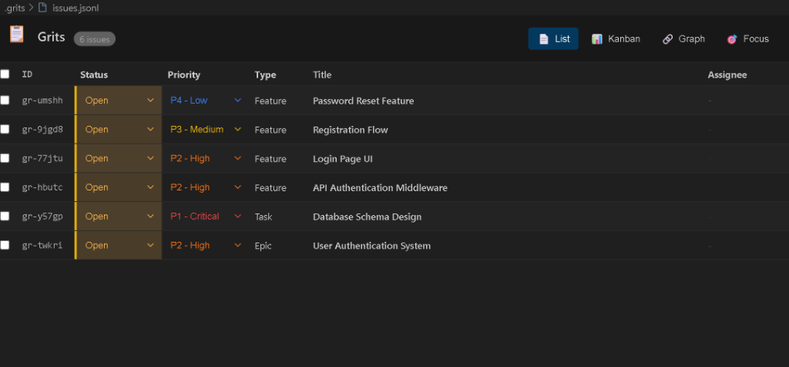
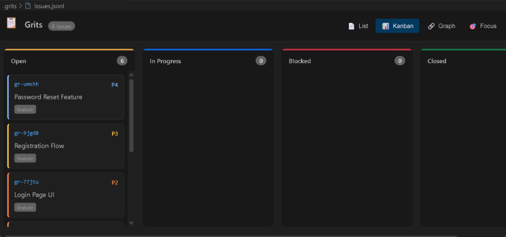
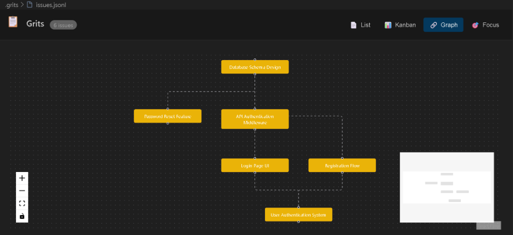
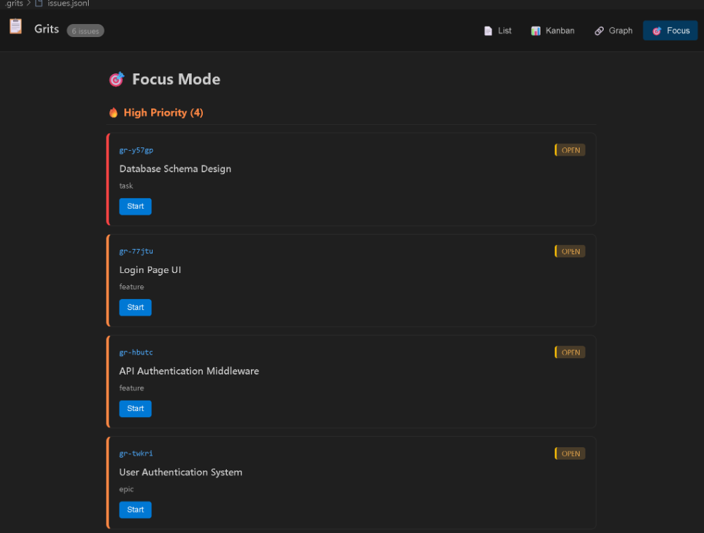

# Grits

A Git-native, local-first issue tracker with a **Twin Engine** architecture:        
- 🤖 **Agent Engine**: MCP server for AI integration (Antigravity, Claude, etc.)
- 👀 **Visual Engine**: VS Code extension with WASM-powered UI

**Status**: Production Ready (v1.2.2)

## Quick Start

### Prerequisites
- Rust (latest stable)
- Git
- Node.js 18+ (for VS Code extension)

### Option 1: Cargo (Recommended for Rust users)

If you have Rust installed, this is the easiest way. It automatically adds `gr` to your PATH:

```bash
cargo install grits-cli
```

### Option 2: Download Binary

**Windows (PowerShell One-Liner):**
```powershell
iwr https://github.com/babybirdprd/grits/releases/latest/download/gr-x86_64-pc-windows-msvc.exe -OutFile gr.exe; mv gr.exe $HOME/.cargo/bin/gr.exe
```

**Manual Download:**
1. Download from [GitHub Releases](https://github.com/babybirdprd/grits/releases).
2. Rename to `gr` (or `gr.exe`).
3. Move to a folder in your PATH.

### Option 3: Build from Source

If you want to contribute or use the latest main branch:

```bash
git clone https://github.com/babybirdprd/grits.git
cd grits
pnpm install
pnpm run build
cargo install --path grits-cli
```

### Initialize a Project
```bash
cd your-project
gr onboard
```

### CLI Usage
```bash
gr create "Fix login bug" -t bug -p 1         # Create issue
gr list --status open                          # List open issues
gr update abc123 --status in-progress          # Update status
gr close abc123                                # Close issue
gr sync                                        # Sync with Git
```

## Twin Engine Architecture

Grits uses a "Unified State" approach where the Human UI and the AI Agent always stay in sync.

### 🔗 Tethered Sync
Whenever the AI Agent (via MCP) or the Human (via UI) modifies an issue, Grits automatically:
1. **Auto-Imports** changes from the `.grits/issues.jsonl` file into the database.
2. **Auto-Exports** database updates back to the file.
This means you can move a card in the Kanban board and the Agent sees it immediately, and vice-versa.

### 🤖 Agent Engine (MCP Server)

Run the MCP server for AI agent integration:
```bash
gr serve-mcp
```

> ⚠️ **Note**: The MCP server is currently untested. Full verification coming in a future release.

**Available Tools:**
| Category | Tools |
|----------|-------|
| **CRUD** | `list_issues`, `create_issue`, `update_issue`, `close_issue`, `get_issue` |
| **Contextual** | `find_related_issues`, `suggest_issue_for_error`, `infer_issue_from_diff` |
| **Bulk** | `bulk_triage`, `detect_duplicates`, `cleanup_stale` |
| **Workflow** | `get_next_task`, `link_commit_to_issues`, `generate_issue_from_todo` |
| **Smart Queries** | `search_issues`, `get_issue_graph`, `summarize_sprint` |

**Antigravity Configuration** (`.vscode/mcp.json`):
```json
{
    "servers": {
        "grits": {
            "command": "gr",
            "args": ["serve-mcp"],
            "env": {
                "GRITS_PROJECT_ROOT": "${workspaceFolder}"
            }
        }
    }
}
```

> **Note**: The `GRITS_PROJECT_ROOT` environment variable tells the MCP server which project to use, ensuring issues are stored in the correct location.

### 👀 Visual Engine (VS Code Extension)

The extension provides a rich UI for `.jsonl` issue files:

- **List View**: Virtualized spreadsheet with inline editing
- **Kanban View**: Drag-and-drop board by status
- **Graph View**: Dependency visualization
- **Focus View**: High-priority items only

| List View | Kanban View |
|-----------|-------------|
|  |  |

| Graph View | Focus View |
|------------|------------|
|  |  |

**Install Extension:**

Download `grits-kanban-*.vsix` from [Releases](https://github.com/babybirdprd/grits/releases) and:
```bash
code --install-extension grits-kanban-0.1.0.vsix
```

Or build from source:
```bash
# From the root directory
pnpm run build

# Then press F5 in VS Code in this workspace
```

## 🔬 Solid Graph Topology

Grits includes **simplicial complex analysis** for code architecture, allowing you to treat code as a "solid" multidimensional structure:

```bash
# 1. Build project-wide topology cache
gr analysis rebuild

# 2. Detect circular dependencies using Betti numbers
gr analysis validate-topology src/lib.rs

# 3. Detect architectural drift (new cycles, removed edges)
gr analysis diff

# 4. Export for visualization (Graphviz/JSON)
gr analysis export topology.dot
```

| Feature | Description |
|---------|-------------|
| **Project Scanning** | Recursively build a unified graph of your codebase |
| **Betti_0/1/2** | Detect components, circular cycles, and 2D voids |
| **Feature Volumes** | Find tightly coupled code clusters ($2$-simplexes) |
| **Star Neighborhoods** | Load precise context for AI editing sessions |
| **Persistence** | Cache topology in `.grits/topology.json` for fast diffs |
| **Issue Linking** | Bind symbols to issues to capture topological context |

> Based on the ["Solid Graph" philosophy](https://arxiv.org/html/2512.19736v1) from algebraic topology.

## Project Structure

```
grits/
├── grits-core/         # Core library (WASM-compatible)
│   └── src/wasm.rs     # WASM bridge for UI
├── grits-cli/          # CLI + MCP server
│   └── src/mcp.rs      # MCP tool implementations
├── extension/          # VS Code extension
│   ├── src/            # Extension host code
│   └── webview/        # React UI
├── .vscode/mcp.json    # MCP server config
└── .agent/workflows/   # Agent workflow rules
```

## Documentation

- [Architecture](docs/architecture.md): Twin Engine design
- [CLI Usage](docs/cli_usage.md): Full command reference
- [WASM Status](docs/wasm_compatibility.md): WebAssembly support
- [Development](docs/development.md): Build & test guide

## Credits

Grits is inspired by [Beads](https://github.com/steveyegge/beads) by Steve Yegge — 
"A memory upgrade for your coding agent." Thank you for pioneering the Git-native 
issue tracking concept for AI agents!

## License

MIT
